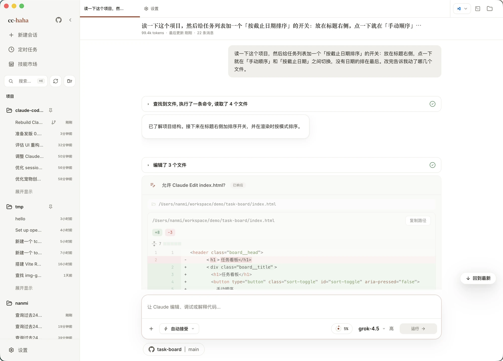
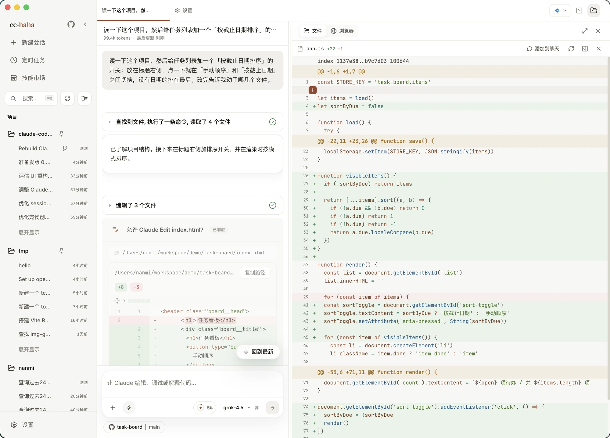
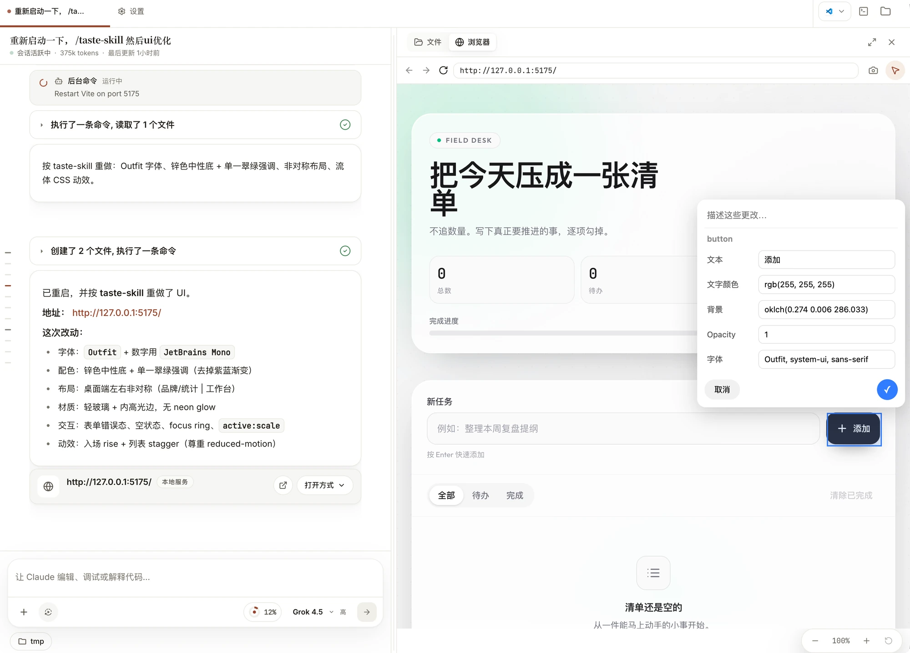
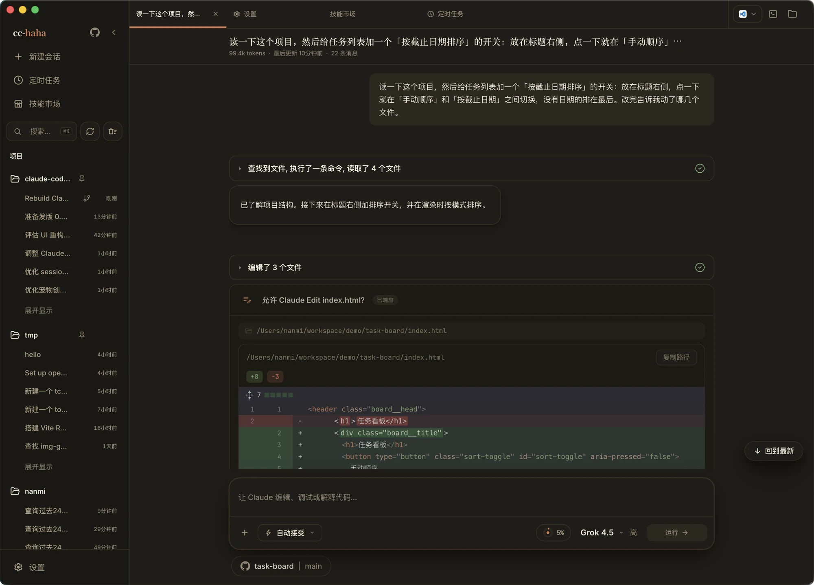
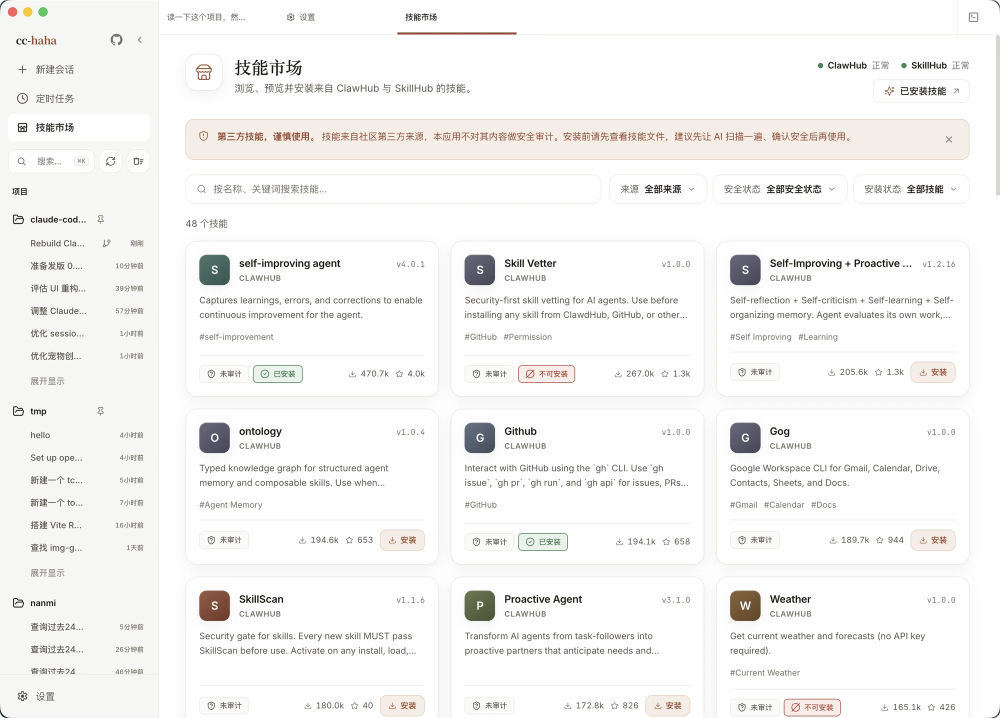
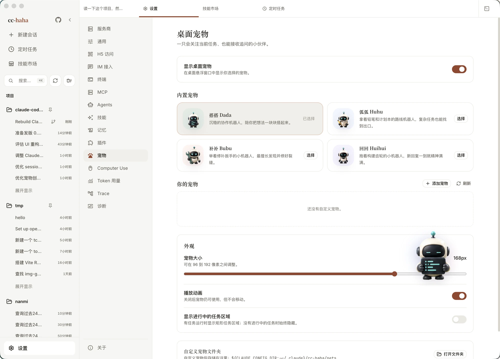

# Claude Code Haha

<p align="center">
  <picture>
    <source media="(prefers-color-scheme: dark)" srcset="docs/images/logo-horizontal-dark.png">
    
  </picture>
</p>

<div align="center">

[](https://github.com/NanmiCoder/cc-haha/stargazers)
[](https://github.com/NanmiCoder/cc-haha/network/members)
[](https://github.com/NanmiCoder/cc-haha/issues)
[](https://github.com/NanmiCoder/cc-haha/pulls)
[](https://github.com/NanmiCoder/cc-haha/blob/main/LICENSE)
[](README.md)
[](README.en.md)
[](https://cchaha.ai)

</div>

Claude Code Haha 基于 2026-03-31 从 Anthropic npm registry 泄露的 Claude Code 源码修复而来，现在主要是一个**桌面端 Claude Code 工作台**：把会话、多项目、分支 / Worktree、工作区改动与 Diff 审阅、权限审批、模型配置、Computer Use、H5 远程访问、IM 接入和定时任务集中到一个 macOS / Windows / Linux APP 里。

<p align="center">
  <a href="#桌面端预览">桌面端预览</a> · <a href="#安装桌面端">安装桌面端</a> · <a href="#桌面端亮点">桌面端亮点</a> · <a href="#更多文档">更多文档</a> · <a href="#用户交流群">用户交流群</a> · <a href="#赞助与合作">赞助与合作</a>
</p>

---

## 桌面端预览

Claude Code Haha 的桌面端把会话、多项目、分支 / Worktree、代码改动、Diff 评审、权限确认、模型配置和远程入口收进一个图形化工作台，适合不想长期停留在终端里的日常开发。

v0.5.0 做了一次全量 UI 重设计（「纸·墨·印」），六套配色可跟随系统深浅色切换。下面六张都拍自 v0.5.0 真机。

<p align="center">
  <a href="https://github.com/NanmiCoder/cc-haha/releases"></a>
  &nbsp;
  <a href="docs/start/install.md"></a>
</p>

<table>
  <tr>
    <td align="center" width="33%"><br><b>说一句话，看它做完</b><br><sub>工具调用和每处改动都留在对话里</sub></td>
    <td align="center" width="33%"><br><b>改了什么，逐个文件看</b><br><sub>带语法高亮的 Diff，你点头才落地</sub></td>
    <td align="center" width="33%"><br><b>改完当场验证</b><br><sub>内置浏览器打开本地服务看效果</sub></td>
  </tr>
  <tr>
    <td align="center" width="33%"><br><b>六套配色可跟随系统</b><br><sub>纯白 · 纸墨 · 经典暖色 · 青瓷 · 墨夜 · 墨夜蓝</sub></td>
    <td align="center" width="33%"><br><b>缺什么手艺装什么</b><br><sub>来源和安全状态摆在明处</sub></td>
    <td align="center" width="33%"><br><b>桌面上有个伴</b><br><sub>搭搭、弧弧、补补、回回随任务换动作</sub></td>
  </tr>
</table>

---

## 安装桌面端

1. 前往 [Releases](https://github.com/NanmiCoder/cc-haha/releases) 下载 macOS / Windows / Linux 桌面端安装包。
2. 首次启动后，在桌面端设置里配置模型提供商、API Key 和默认模型。
3. 正式 macOS Release 需要经过签名和公证；如果安装的是 draft/unsigned 临时包，首次打开可能仍需手动放行。Windows 未签名安装包可能出现 SmartScreen 提示，点「更多信息」→「仍要运行」即可。详见 [桌面端安装指南](docs/start/install.md)。

## 从源码启动 CLI

适合想调试底层 CLI、服务端或自行开发的用户：

```bash
bun install
cp .env.example .env
./bin/claude-haha
```

更多配置见 [环境变量](docs/cli/env.md) 和 [命令行安装与启动](docs/cli/index.md)。

---

## 桌面端亮点

- **多会话工作台**：标签页、项目切换、终端入口和会话历史集中管理，侧边栏宽度可拖拽。
- **分支 / Worktree 启动**：新会话可以选择仓库分支，并决定用当前工作树还是隔离 Worktree。
- **改动逐个文件审阅**：右侧工作区列出本轮改动，点开就是带语法高亮的 Diff，整轮可撤销。
- **五档权限模式**：从「询问权限」到「跳过权限」，危险命令、工具调用和 AI 反问都在桌面端审批。
- **模型自选**：Claude / ChatGPT / Grok 官方账号可直接登录；DeepSeek、Kimi、智谱 GLM 等第三方 API 有现成预设；LM Studio、Ollama 的本地模型也接得上。
- **六套配色主题**：纯白、纸墨、经典暖色、青瓷、墨夜、墨夜蓝，可跟随系统深浅色自动切换。
- **技能市场**：发现、预览、安装 ClawHub / SkillHub 的第三方技能，来源和安全状态摆在明处。
- **会话活动面板**：集中查看任务进度、后台任务、SubAgent 与来源。
- **Computer Use**：让 Agent 在授权后截图、点击、输入并控制桌面应用。
- **桌面宠物**：搭搭、弧弧、补补、回回随任务状态换动作，也能自己做一只（默认关闭）。
- **H5 远程访问**：扫码用手机浏览器接入当前会话，锁屏切后台都不打断正在跑的任务。
- **IM 接入**：通过 Telegram / 飞书 / 微信 / 钉钉 / WhatsApp 远程对话、切换项目和审批权限。
- **定时任务与用量统计**：创建计划任务在独立会话执行，并查看本机 Token 使用趋势。

---

## 更多文档

完整文档站：<https://cchaha.ai>

| 分区 | 文档 |
|------|------|
| **开始使用** | [这是什么](docs/start/index.md) · [下载与安装](docs/start/install.md) · [连接模型服务](docs/start/models.md) · [跑通第一条会话](docs/start/first-session.md) · [故障排查](docs/start/troubleshooting.md) |
| **桌面端功能** | [功能总览](docs/desktop/index.md) · [Computer Use](docs/desktop/computer-use.md) · [桌面宠物](docs/desktop/pets.md) · [手机 H5 与 IM 接力](docs/desktop/remote.md) |
| **IM 接入** | [总览与配对流程](docs/im/index.md) · [飞书](docs/im/feishu.md) · [Telegram](docs/im/telegram.md) · [微信](docs/im/wechat.md) · [钉钉](docs/im/dingtalk.md) · [WhatsApp](docs/im/whatsapp.md) |
| **命令行** | [安装与启动](docs/cli/index.md) · [命令参考](docs/cli/reference.md) · [环境变量](docs/cli/env.md) |
| **深入原理** | [桌面端架构](docs/internals/desktop.md) · [多 Agent 系统](docs/internals/agent.md) · [Skills 系统](docs/internals/skills.md) · [记忆系统](docs/internals/memory.md) · [Computer Use 架构](docs/internals/computer-use.md) · [本地 Server 与 API](docs/internals/server.md) · [Channel 系统](docs/internals/channel.md) · [项目结构](docs/internals/structure.md) · [参与贡献与质量门禁](docs/internals/contributing.md) |

---

## 用户交流群

使用过程中有问题、想反馈 Bug，或者想看看别人怎么用，欢迎扫码加入 cc-haha 飞书用户群。也可以直接来 [Issues](https://github.com/NanmiCoder/cc-haha/issues) 提问。

<p align="center">
  <br>
  <sub>二维码 2027/7/28 前有效，过期后会在这里更新</sub>
</p>

---

## 赞助与合作

本项目由个人利用业余时间维护，欢迎企业或个人赞助支持持续开发，也可洽谈定制、集成或商务合作。

<table>
  <thead>
    <tr>
      <th width="220">赞助商</th>
      <th align="left">介绍</th>
    </tr>
  </thead>
  <tbody>
    <tr>
      <td align="center" valign="middle">
        <a href="https://www.shengsuanyun.com/?from=CH_LEJ88KWR">
          
        </a>
      </td>
      <td valign="middle">
        感谢 <a href="https://www.shengsuanyun.com/?from=CH_LEJ88KWR">胜算云</a> 赞助本项目！胜算云是面向 AI Native Teams 的工业级 AI 任务并行执行平台，聚合 Claude、ChatGPT、Gemini 等海内外 LLM 及图片、视频多媒体模型算力；官方直连、非逆向，平台 SLA 可用性达 99.7%，可查看 <a href="https://watch.shengsuanyun.com/status/shengsuanyun">服务状态</a>。平台支持企业专属网关、成本与权限管控、智能路由、安全防护和 BYOK，按量与 tokens plan（即将上线）计费并可开票；使用 <a href="https://www.shengsuanyun.com/?from=CH_LEJ88KWR">专属链接</a> 注册可获 10 元模力及首充 10% 赠送。
      </td>
    </tr>
    <tr>
      <td align="center" valign="middle">
        <a href="https://teamorouter.com/?utm_source=cc_haha&utm_medium=referral&utm_campaign=ai_directory">
          
        </a>
      </td>
      <td valign="middle">
        感谢 <a href="https://teamorouter.com/?utm_source=cc_haha&utm_medium=referral&utm_campaign=ai_directory">TeamoRouter</a> 赞助本项目！TeamoRouter 是面向开发者、AI 团队与企业的企业级 Agentic LLM 网关，无需任何订阅即可通过统一 API 使用 Claude Code、Codex、Gemini CLI 等热门 AI Agent，API 价格最高可享 90% 折扣。平台聚合 OpenAI、Anthropic、Vertex、Azure、AWS Bedrock 等数百家官方模型提供商与可信基础设施，全部经过 100% Agent 协议兼容、缓存性能与请求可追踪性验证，官方直连、非逆向，提供接近官方的 TTFT、99.6% SLA、最高 5,000 QPM 吞吐与行业领先的缓存命中率；同时支持集中账单、团队管理、BYOK、智能路由、用量分析与专属支持，并可通过 Teamo Desktop 一键使用各类 AI Agent。新用户通过 <a href="https://teamorouter.com/?utm_source=cc_haha&utm_medium=referral&utm_campaign=ai_directory">专属链接</a> 注册，首次充值可享 10% 折扣。
      </td>
    </tr>
  </tbody>
</table>

📧 **联系邮箱**：relakkes@gmail.com

---

## ☕ 请作者喝杯咖啡

如果这个项目对您有帮助，欢迎打赏支持，您的每一份支持都是我持续更新的动力 ❤️

<table>
<tr>
<td align="center" width="33%">
<br>
<b>微信赞赏</b>
</td>
<td align="center" width="33%">
<br>
<b>支付宝</b>
</td>
<td align="center" width="33%">
<a href="https://buymeacoffee.com/relakkes" target="_blank">

</a><br>
<b>Buy Me a Coffee</b>
</td>
</tr>
</table>

---

## 技术栈

| 类别 | 技术 |
|------|------|
| 语言 | TypeScript |
| 桌面 APP | Electron |
| 桌面 UI | React + Vite |
| 本地运行时 | [Bun](https://bun.sh) |
| 终端 UI | React + [Ink](https://github.com/vadimdemedes/ink) |
| CLI 解析 | Commander.js |
| API | Anthropic SDK |
| 协议 | MCP, LSP |

## 感谢

感谢以下开源项目和社区实践为本项目提供参考与启发：

- [React](https://github.com/facebook/react)：前端工程与组件化 UI 生态。
- [Electron](https://github.com/electron/electron)：跨端桌面应用能力与工程实践。
- [cc-switch](https://github.com/farion1231/cc-switch)：模型供应商配置能力参考。


---

## Disclaimer

本仓库基于 2026-03-31 从 Anthropic npm registry 泄露的 Claude Code 源码。所有原始源码版权归 [Anthropic](https://www.anthropic.com) 所有。仅供学习和研究用途。
