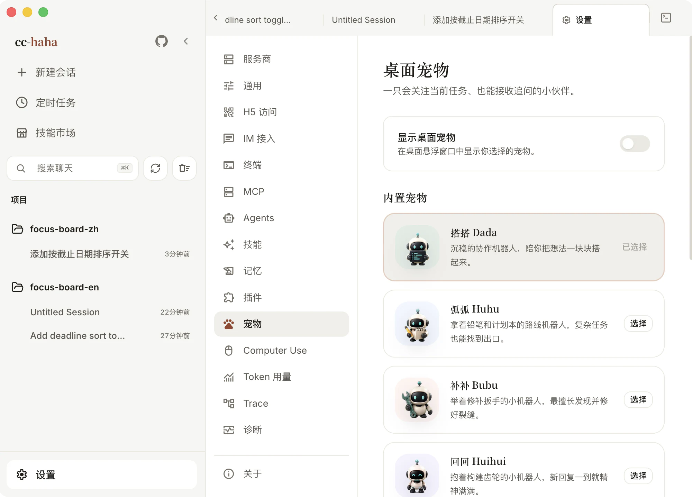
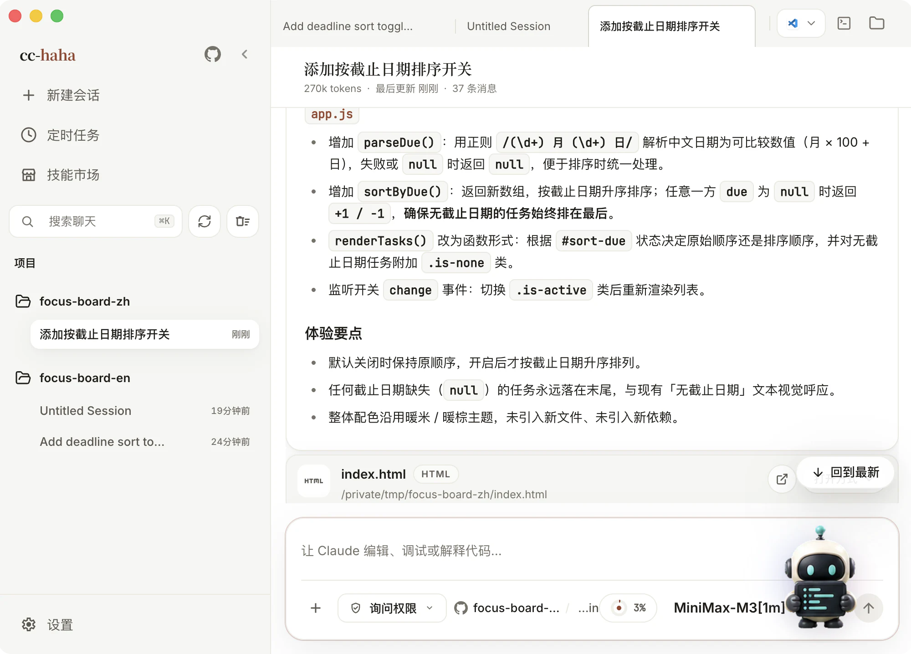

# 桌面宠物

一只悬浮在桌面上的小机器人。它会用动作反映本机任务的状态——在跑的时候低头忙活，等你审批的时候东张西望，出错了垂头丧气。你去做别的事时，瞄一眼就知道该不该切回来。

它只是个状态提示和跳转入口，不能替你批准权限，也不能在悬浮窗里直接提问。

## 打开它

宠物**默认关闭**。打开方式：

1. 点侧边栏最底部的「设置」。
2. 选「宠物」分栏。
3. 从「内置宠物」里挑一个。
4. 打开「显示桌面宠物」。

## 四只内置宠物

| 角色 | 它是谁 |
|---|---|
| 搭搭 Dada | 沉稳的协作机器人，陪你把想法一块块搭起来 |
| 弧弧 Huhu | 拿着铅笔和计划本的路线机器人，复杂任务也能找到出口 |
| 补补 Bubu | 举着修补扳手的小机器人，最擅长发现并修好裂缝 |
| 回回 Huihui | 抱着构建齿轮的小机器人，新回复一到就精神满满 |

换角色时已经打开的宠物窗口会立刻同步。

## 和它互动

- **悬停** — 空闲时它会跳一下，视线跟着你的指针转。
- **单击** — 唤起主窗口，同时挥个手。注意它只是把窗口叫出来，不会自动跳进某条会话。
- **拖动** — 按住它挪到桌面别的位置，下次打开会尽量回到原处。
- **右键** — 系统菜单里选「关闭宠物」。这只关掉悬浮窗，不会停掉任何任务。想再开回 设置 → 宠物。

打开「显示进行中的任务区域」后，有任务在跑时它旁边会出现一块任务面板，按状态分组：

- **工作中** — 会话、后台任务或 Agent 正在跑。
- **等待你处理** — 在等权限审批或其他操作。
- **需要关注** — 最近一次运行失败了。

点任务行会唤起主窗口并跳到那条会话。权限还是要在主窗口里批。关掉这个开关的话，有活跃任务时只保留一个数字角标，点角标能再展开。

## 外观参数

- **宠物大小** — 96 到 192 像素之间。
- **播放动画** — 关掉之后宠物还在，只是不动了。想要安静一点又不想彻底关掉时用它。
- **显示进行中的任务区域** — 见上。
- **默认收起** — 平时只露宠物，需要时再展开任务面板。

## 做一只自己的

点「你的宠物」右边的「添加宠物」。所有图片都在你自己的电脑上处理，不会上传，也不消耗对话额度。

不管选哪种做法都要先填三个字段：**宠物 ID**（只用小写字母、数字和中间的连字符，比如 `moon-cat`）、**显示名称**、**宠物描述**。

### 做法一：用一张现成的图

最省事，大概一分钟。选一张背景透明的静态 PNG 或 WebP，应用会给它加上呼吸和上下浮动的轻动画。

这种宠物**不会跑、不会挥手、不会跟着鼠标转头**。想要完整动作，用下面两种。

### 做法二：让 AI 画一张动作表

大概十分钟，需要一个能画图的 AI。弹窗里已经准备好一段完整提示词和一张对照模板，点「复制这段提示词」就能直接发给 AI，只要把开头「角色」那两行换成你想要的样子。

要画的是一张 **8 列 × 9 行**的动作表，每格一个动作帧：

| 行 | 内容 | 用到的格数 |
|---|---|---|
| 1 | 待机：站着不动，轻微呼吸起伏 | 6 |
| 2 | 向右跑：完整跑步循环，始终朝右 | 8 |
| 3 | 挥手：抬手打招呼 | 4 |
| 4 | 跳跃：下蹲 → 起跳 → 落地 | 5 |
| 5 | 失败：沮丧、垂头、叹气 | 8 |
| 6 | 等待：东张西望、原地踱步 | 6 |
| 7 | 工作：低头忙碌 | 6 |
| 8 | 视线上半圈：从正上方转到接近正下方 | 8 |
| 9 | 视线下半圈：从正下方转回接近正上方 | 8 |

「向左跑」不用画，应用会把第 2 行水平镜像自动补出来。最后两行懒得画也行，重复待机的第一帧就好，只是它不会跟着鼠标转头。

图出来以后对着弹窗里的模板检查三件事：背景是透空的不是白底、横 8 格竖 9 行、九行里从头到尾是同一只。不对就让 AI 重画，或者说「角色保持不变，只重画第 2 行」。

### 做法三：我已经有动作图了

已经画好了就走这条，跳过教程直接填表选图。校验规则和做法二完全一样。

### 尺寸不用自己算

选图之后应用会在本地把它整理成运行时需要的图集：按 8 列 × 9 行切格、等比缩放、把角色在格子里居中、镜像补出向左跑的一行，再补齐其余行。

所以**长宽不必是某个精确数值**，AI 常出的 `1024 × 1152` 之类都能用，比例接近 8:9 时效果最好。已经是 `1536 × 2288` 的成品图集会原样保留，不会被重新缩放。

图片本身要满足：静态 PNG 或 WebP（动图不行）、长宽都在 32–4096 像素之间、总像素不超过 16,777,216、文件不超过 8 MB。

:::warning
最常见的失败是**白底**。白底导出的图在桌面上会变成一个方块，应用会直接拒绝导入。让 AI 重新导出透明背景的 PNG，或者用抠图工具去掉背景。
:::

## 存在哪、怎么删

自定义宠物包在 `${CLAUDE_CONFIG_DIR:-~/.claude}/cc-haha/pets`，设置页底部有「打开文件夹」按钮。每只宠物一个独立子目录，里面是 `pet.json` 和图片。

界面上目前没有删除按钮。要删的话：先在设置页选回一只内置宠物，点「打开文件夹」，只删掉目标宠物那个子目录，回设置页点「刷新」。不要删整个 `pets` 或 `cc-haha` 目录。

手工改过的 `pet.json` 或替换过的图片可能过不了校验，无效的包会被跳过并在设置页提示。

## 边界

宠物只在桌面端跑，H5 页面里看不到它。退出应用或电脑休眠后它不会继续工作。窗口置顶、拖动和多显示器的行为受各操作系统限制。
