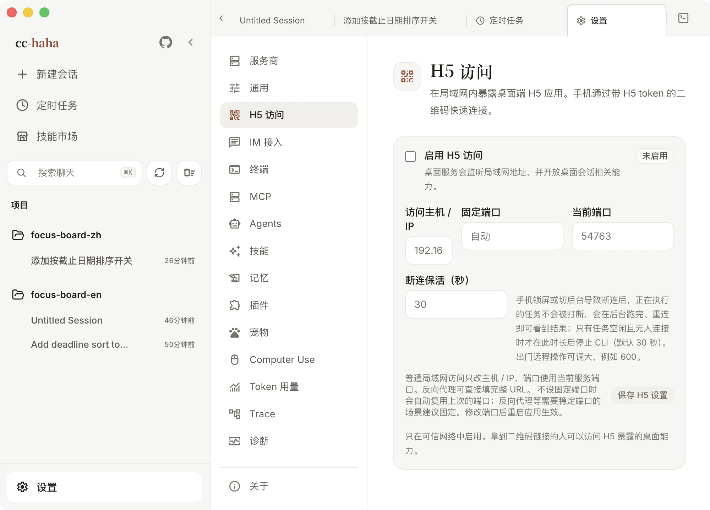
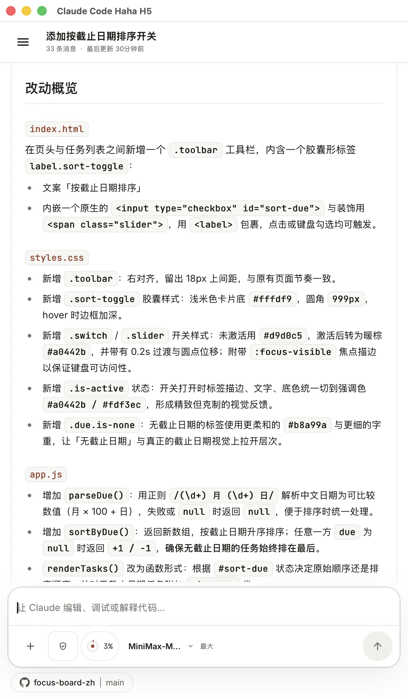
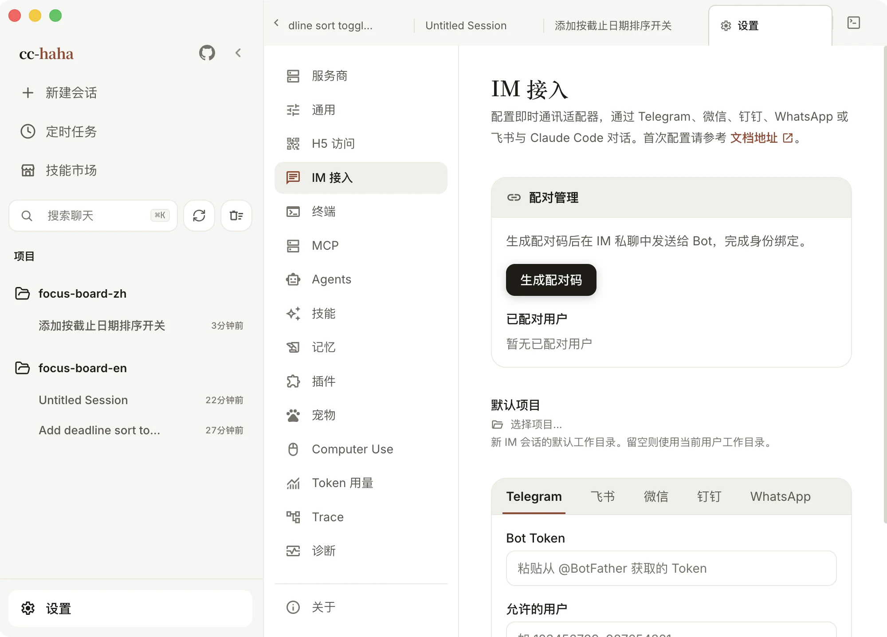

# 手机 H5 与 IM 接力

电脑上跑着的任务，想在手机上看进度、追加一句话，有两条路：

- **H5 访问** — 手机浏览器打开同一套界面，会话、消息、附件、权限按钮都在。
- **IM 接入** — 在微信、钉钉、WhatsApp、Telegram、飞书里直接和 Claude 对话。

两条路都需要你的电脑开着、应用在跑。它们把桌面服务开放出来，不是把数据搬到云端。

## H5 访问

### 开启

1. 打开 设置 → H5 访问。
2. 打开「启用 H5 访问」，读一遍风险提示后确认。
3. 点「生成令牌」，页面上会出现二维码和 H5 链接。
4. 用手机扫码，或者点「复制扫码链接」发到自己的设备上。

扫出来的链接里带着服务器地址和令牌，手机浏览器打开后会把连接信息存下来，之后直接打开就能用。

### 令牌是访问凭据

拿到这条链接的人就能访问你桌面上暴露出来的能力。所以：

- 不要把带令牌的链接贴进群聊、公开 Issue、日志截图或任何公开页面。
- 只在可信网络里开。公网使用请自己套 HTTPS、VPN 或访问控制，不要只靠一个长期令牌。
- 怀疑泄露了就点「重新生成令牌」。旧二维码和旧令牌会立刻失效——只是关掉再打开 H5 不会换令牌。

不用的时候关掉。关掉会立即拒绝远程访问，但令牌保留着，下次开还是同一个。

:::warning
H5 默认关闭，它也不是公开服务。开启前先确认你在自己信得过的网络里。
:::

### 访问主机与固定端口

「访问主机 / IP」填电脑当前的局域网 IP，比如 `192.168.1.20`，端口用当前服务端口。换了 Wi-Fi 或插拔网线之后原 IP 可能失效，页面会提示你切到可用的那个。

如果你自己有反向代理，这里可以直接填完整 URL，比如 `https://cc.example.com`，并把这个域名加进「允许的来源」。

**固定端口**在这几种情况下值得设：手机书签要长期不变、防火墙只放行指定端口、Nginx 或 Caddy 固定转发一个上游端口。端口要在 1024–65535 之间，改完重启应用才生效——页面会告诉你现在还跑在哪个端口上。

### 手机锁屏不会打断任务

「断连保活」解决的是这个问题：手机锁屏、切后台或者短暂断网时，**正在执行的任务不会被停掉**，它会在后台跑完，重连就能看到结果。

只有当任务已经空闲、并且没有任何设备连着时，才会在保活时间到期后停掉对应进程。默认 30 秒，可配范围是 5 秒到 24 小时。出门远程操作可以调大一些，比如 600。

### 手机上能做什么

会话列表和项目切换、发消息、停止、看流式回复、图片和文件附件、权限按钮、AI 提问、`@` 引用文件、复制和 Fork——对话主流程都在。

桌面工作区、内嵌终端、原生「打开方式」、Computer Use 授权和桌面宠物不在 H5 里。

## IM 接入

设置 → IM 接入 支持五个平台，接入方式各不相同：

| 平台 | 怎么接 |
|---|---|
| 微信 | 在设置页生成二维码，用微信扫码绑定账号 |
| 钉钉 | 扫码一键创建并授权机器人，也可以手动填 Client ID / Secret |
| WhatsApp | 生成二维码，在 WhatsApp 的「已关联设备」里扫码 |
| Telegram | 找 @BotFather 要一个 Bot Token 填进来 |
| 飞书 | 填 App ID 和 App Secret；没有机器人的话可以用页面上的模板一键创建 |

### 绑定账号 ≠ 允许对话

这是最容易踩的一步：**扫码只绑定了账号能力，具体哪个人能和 Bot 对话是另一回事。**

在「配对管理」里点「生成配对码」，然后用你自己的 IM 账号私聊 Bot 把这串码发过去，绑定才算完成。也可以在「允许的用户」里直接填用户 ID 列表。两者都为空时默认拒绝所有人——这是有意为之。

已配对的用户会列在下面，可以随时解绑，解绑后需要重新配对。

### 其他设置

- **默认项目** — 新 IM 会话用哪个工作目录。留空则用当前用户工作目录。
- **流式卡片模式** — 实时更新消息内容，读起来更像在看它打字。
- **权限请求** — 钉钉可以配互动卡片模板 ID，用卡片按钮授权；不配的话所有平台都用 `/allow`、`/always`、`/deny` 文本命令。

五个平台各自的申请流程、权限配置和排查步骤，见[IM 接入](../im/index.md)。
