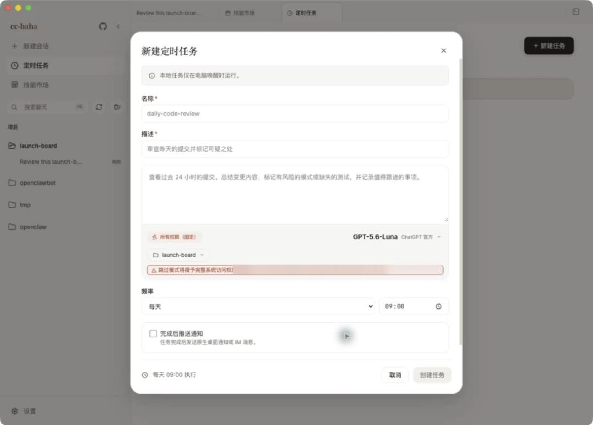

# 定时任务

把一段提示词存下来，让它按时间自动跑。典型用法是每天早上审查昨天的提交、每周整理一次待办、每小时检查一遍某个服务的日志。

## 从哪进去

点侧边栏的「定时任务」打开任务列表页，右上角「＋ 新建任务」。

任务列表页顶部有一条常驻提示，说的就是下面这件事。

:::warning
定时任务只在桌面应用打开、且电脑处于唤醒状态时运行。合上盖子、退出应用、关机，任务都不会跑，也不会补跑。它不是云端调度器。
:::

## 新建任务的每个字段

- **名称**（必填）— 列表里显示的标识，建议用短横线风格，比如 `daily-code-review`。
- **描述**（必填）— 一句话说明这个任务干什么，方便以后自己认出来。
- **提示词** — 真正发给 Claude 的内容。把上下文写足：要看哪些东西、关注什么、输出成什么格式。它跑的时候你不在旁边，没人给它补充说明。
- **权限** — 固定为「所有权限」，表单里不让选。提示词编辑器下面会直接标出这次运行的目录范围。因此：**工作目录一定要选到最小范围，提示词也要先自己读一遍**。
- **模型** — 单独指定，不跟随会话的默认模型。日常巡检类任务用便宜的模型就够。
- **工作目录** — 任务运行的项目目录。也可以开「独立工作树」，让任务在隔离的 Git worktree 里跑，不碰你的主分支。
- **频率** — 每 N 分钟 / 每 N 小时 / 每天 / 工作日（周一至周五）/ 指定星期几 / 每月 / 自定义 Cron 表达式。选「每天」这类时右边会多出一个时间选择器。自定义 Cron 的格式是「分 时 日 月 星期」，填错了下面会当场提示无效。
- **完成后推送通知** — 打开后可选通知渠道：桌面系统通知，以及已经配好的 IM 渠道。没配过 IM 会提示你去 设置 → IM 接入 配置，步骤见[手机 H5 与 IM 接力](./remote.md)。

系统通知需要在 设置 → 通用 里先打开「启用系统通知」并授予系统权限。

任务会带一点随机延迟触发，避免整点一堆任务同时开跑。

## 跑起来之后

任务卡片上有这些操作：

- **立即执行** — 不等下次触发，现在就跑一遍。新建任务后建议先手动跑一次，确认提示词写对了。
- **日志** — 打开执行记录，每次运行一行，带状态（运行中 / 已完成 / 失败 / 超时）和耗时。点「摘要」看输出片段，点「查看完整对话」跳到那次运行对应的完整会话。
- **编辑** — 改任何字段，包括频率。
- **禁用 / 启用** — 暂时停掉但不删。
- **删除** — 连同它的所有日志一起永久删除。

列表页顶部三个数字是总任务数、活跃、已禁用。

## 几个实践建议

1. **先手动跑一次再定频率。** 提示词的毛病在第一次运行就会暴露。
2. **工作目录选窄一点。** 任务以完整权限运行，目录范围就是它的活动边界。
3. **频率别太密。** 每分钟跑一次的任务很快会烧掉不少 token，也会把日志刷满。
4. **让它输出结论而不是过程。** 在提示词里明确要求「最后用三行总结」，通知里才看得下去。
