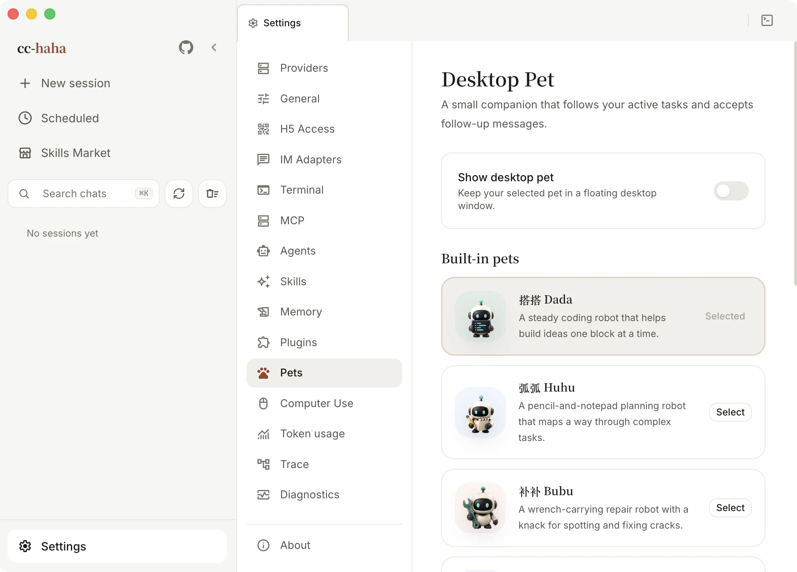
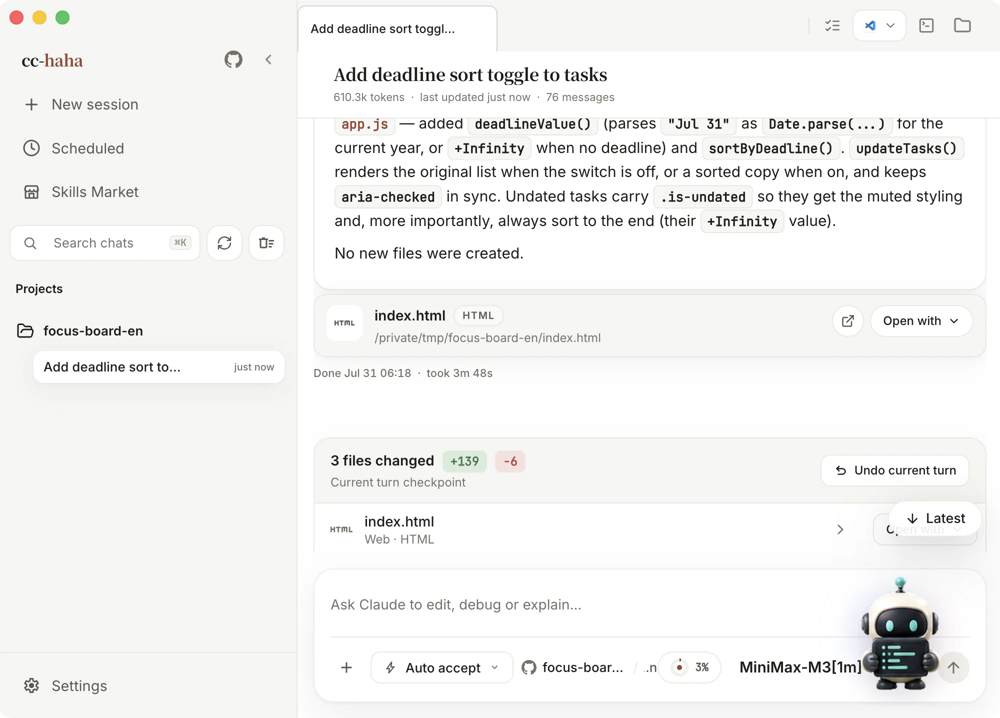

# Desktop pet

A small robot that floats above your desktop and acts out what's happening on this machine — head down and busy while a task runs, glancing around while it waits for your approval, slumped over when something failed. Glance at it while you're doing something else and you'll know whether to switch back.

It's a status indicator and a shortcut, nothing more. It can't approve permissions for you, and you can't type into it.

## Turning it on

The pet is **off by default**:

1. Click **Settings** at the bottom of the sidebar.
2. Choose the **Pets** tab.
3. Pick one from **Built-in pets**.
4. Turn on **Show desktop pet**.

## The four built-in pets

| Character | Who it is |
|---|---|
| Dada | A steady coding robot that helps build ideas one block at a time |
| Huhu | A pencil-and-notepad planning robot that maps a way through complex tasks |
| Bubu | A wrench-carrying repair robot with a knack for spotting and fixing cracks |
| Huihui | A gear-carrying build robot that perks up whenever a new reply arrives |

Switching characters updates an already-open pet window immediately.

## Interacting with it

- **Hover** — while idle it hops, and its gaze follows your pointer.
- **Click** — brings the main window forward with a wave. Note that it only raises the window; it doesn't jump into a particular session.
- **Drag** — move it anywhere on the desktop. It tries to return to the same spot next launch.
- **Right-click** — choose **Close pet** from the system menu. That closes the floating window only; no task is stopped. To bring it back, return to **Settings → Pets**.

With **Show active task panel** enabled, a panel appears beside the pet whenever work is in flight, grouped by state:

- **Working** — a session, background task, or agent is running.
- **Waiting for you** — something needs a permission approval or other input.
- **Needs attention** — the last run failed.

Clicking a row raises the main window and opens that session. Permissions are still approved in the main window. With the panel off, active work collapses to a numeric badge you can click to expand.

## Appearance controls

- **Pet size** — anywhere between 96 and 192 pixels.
- **Play animations** — turn it off and the pet stays but stops moving. Useful when you want it quieter without dismissing it.
- **Show active task panel** — see above.
- **Collapsed by default** — show just the pet and expand the task panel only when you want it.

## Making your own

Click **Add pet** to the right of **Your pets**. Every image is processed on your own machine — nothing is uploaded, and nothing costs conversation credits.

All three routes ask for the same three fields first: a **pet ID** (lowercase letters, digits, and single hyphens, e.g. `moon-cat`), a **display name**, and a **description**.

### Route 1: use an image you already have

The quickest — about a minute. Pick a static PNG or WebP with a transparent background and the app adds gentle breathing and floating motion.

This kind of pet **won't run, wave, or track your cursor**. For that, use one of the routes below.

### Route 2: have an AI draw an action sheet

About ten minutes and an image-generating AI. The dialog already contains a complete prompt and a reference template; click **Copy this prompt** and paste it into the AI, replacing the two "character" lines with what you want.

What it needs to draw is an **8-column by 9-row** action sheet, one frame per cell:

| Row | Content | Frames used |
|---|---|---|
| 1 | Idle: standing still with a slight breathing motion | 6 |
| 2 | Run right: a full run cycle, always facing right | 8 |
| 3 | Wave: raising a hand in greeting | 4 |
| 4 | Jump: crouch, leap, land | 5 |
| 5 | Fail: dejected, head down, sighing | 8 |
| 6 | Wait: looking around, pacing in place | 6 |
| 7 | Work: head down, busy | 6 |
| 8 | Gaze, upper arc: from straight up around to nearly straight down | 8 |
| 9 | Gaze, lower arc: from straight down back around to nearly straight up | 8 |

"Run left" doesn't need drawing — the app mirrors row 2 horizontally. The last two rows are optional too; repeat the first idle frame and the pet simply won't track your cursor.

When the image comes back, check three things against the template in the dialog: the background is genuinely transparent rather than white, it really is 8 across by 9 down, and it's the same character in all nine rows. If not, ask the AI to redraw — "keep the character, redraw row 2 only" works well.

### Route 3: I already have an action sheet

Skip the tutorial and go straight to the form. The validation rules are identical to route 2.

### You don't have to compute the size

Once you pick the image, the app assembles the runtime atlas locally: it slices the 8×9 grid, scales proportionally, centers the character in each cell, mirrors the run-left row, and fills in the remaining rows.

So the **dimensions don't need to be exact**. Common AI output sizes like `1024 × 1152` work fine, and anything close to an 8:9 ratio works best. An existing `1536 × 2288` atlas is kept as-is and never rescaled.

The image itself must be: a static PNG or WebP (no animated formats), between 32 and 4096 pixels on each side, at most 16,777,216 pixels total, and under 8 MB.

:::warning
The most common failure is a **white background**. A white-backed image becomes a rectangle sitting on your desktop, so the app rejects it outright. Have the AI re-export a transparent PNG, or remove the background yourself.
:::

## Where they live, and deleting one

Custom pet packages live in `${CLAUDE_CONFIG_DIR:-~/.claude}/cc-haha/pets`, and there's an **Open folder** button at the bottom of the settings page. Each pet gets its own subdirectory containing `pet.json` and its images.

There's no delete button in the UI yet. To remove one: select a built-in pet first, click **Open folder**, delete only that pet's subdirectory, then click **Refresh** back in settings. Don't delete the whole `pets` or `cc-haha` directory.

A hand-edited `pet.json` or a swapped image may fail validation; invalid packages are skipped and reported in the settings page.

## Limits

The pet is desktop-only and never appears in H5. It stops working when you quit the app or the machine sleeps. Always-on-top behavior, dragging, and multi-monitor placement are all subject to what each operating system allows.
