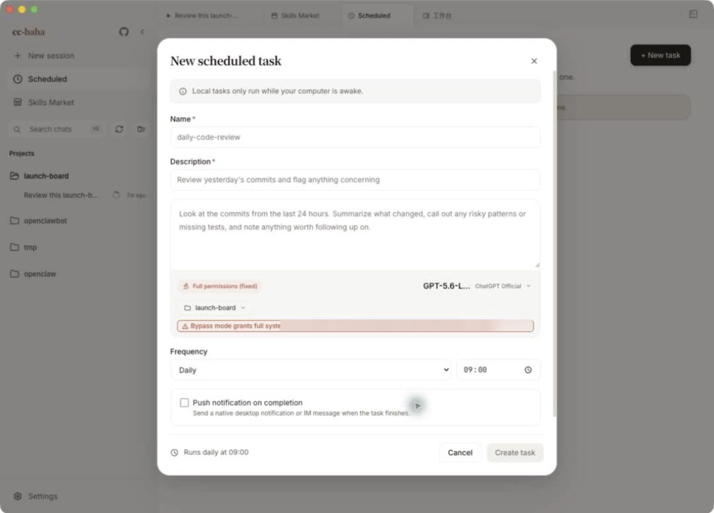

# Scheduled tasks

Save a prompt and have it run on a schedule. The usual jobs: review yesterday's commits every morning, tidy the backlog weekly, check a service's logs hourly.

## Where to start one

Click **Scheduled** in the sidebar to open the task list, then **+ New task** in the top right.

The list page carries a standing notice about the following.

:::warning
Scheduled tasks only run while the desktop app is open and your computer is awake. Close the lid, quit the app, or shut down and nothing fires — and nothing is caught up afterwards. This is not a cloud scheduler.
:::

## Every field in the form

- **Name** (required) — the identifier in the list. A hyphenated form like `daily-code-review` reads well.
- **Description** (required) — one line about what it does, so you recognize it later.
- **Prompt** — what actually gets sent to Claude. Give it the full context: what to look at, what to care about, what format to output. You won't be there to clarify.
- **Permissions** — fixed at **Full permissions (fixed)**; the form doesn't offer a choice. The prompt editor shows the directory scope of the run right below. So: **pick the narrowest possible working directory, and read your own prompt once before saving.**
- **Model** — set per task, independent of your session default. Routine checks are fine on a cheaper model.
- **Working directory** — where the task runs. You can also enable **Isolated worktree** so the task works in a separate Git worktree and never touches your main branch.
- **Frequency** — every N minutes, every N hours, daily, weekdays (Mon–Fri), specific days, monthly, or a custom cron expression. Time-of-day options get their own picker beside the frequency. Custom cron is "minute hour day month weekday" and invalid expressions are flagged as you type.
- **Push notification on completion** — pick channels: native desktop notifications and any IM channels you've configured. If no IM channel is set up, the form points you to **Settings → IM Adapters**; setup steps are in [Phone (H5) and IM](./remote.md).

Desktop notifications need **System Notifications** enabled in **Settings → General** and permission granted at the OS level.

Tasks fire with a small random delay so a dozen jobs don't all start on the same tick.

## Once it's running

Each task card offers:

- **Run now** — don't wait for the next trigger. Do this once right after creating a task to confirm the prompt works.
- **Logs** — the execution log, one row per run, with status (running, completed, failed, timeout) and duration. **Summary** shows the output excerpt; **View conversation** jumps to the full session for that run.
- **Edit** — change any field, including the frequency.
- **Disable / Enable** — pause without deleting.
- **Delete** — removes the task and all of its logs permanently.

The three numbers at the top of the list are total tasks, active, and disabled.

## A few habits worth having

1. **Run it manually before setting a frequency.** Prompt problems show up on the very first run.
2. **Keep the working directory narrow.** The task runs with full permissions, so the directory is its boundary.
3. **Don't schedule it too tightly.** A task that runs every minute burns tokens fast and floods the log.
4. **Ask for a conclusion, not a transcript.** Put "summarize in three lines at the end" in the prompt, or the notification will be unreadable.
