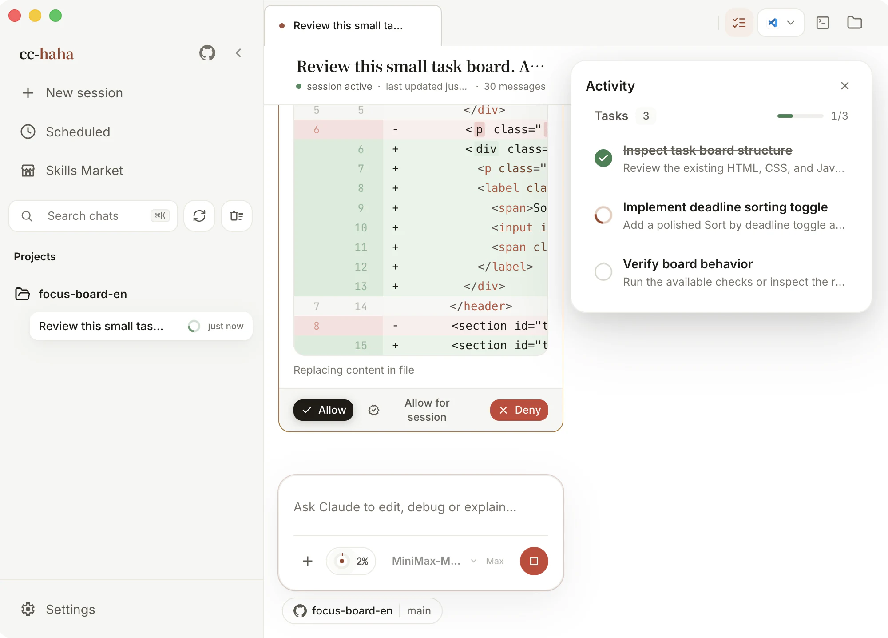

# Sessions, permissions, and review

A session is one complete collaboration: you describe what you want, Claude reads files, runs commands, and edits code, and every step stays in the conversation where you can go back and check it. This page explains what each part of the session screen does.

## Starting a session

Click **New session** in the sidebar, or press `⌘N` (`Ctrl+N` on Windows and Linux). The empty session asks you for exactly one thing: a project directory. After that you can start typing — the model and permission mode come from your defaults in Settings.

Each session opens as a tab, and you can run many side by side. A dot on the tab means that session is still running; closing a running tab asks whether you want to **Keep running** or **Stop and close**.

The small line under the session title is metadata: project path, branch, model. A session is bound to one directory — to work on a different project, start a new session.

## Reading the conversation

Claude doesn't just reply with a paragraph. Several kinds of card appear along the way:

- **Tool cards** — reading files, searching, running commands. Consecutive operations of the same kind collapse into one line, like "Read 6 files" or "edited 3 files"; expand it to see the details. Skim them normally, open them when something goes wrong.
- **Thinking blocks** — the reasoning before it acts, labelled **Thinking** while it runs and **Thought** once done. Collapsed by default.
- **File edits** — shown as an inline diff right in the conversation, so you don't have to look anywhere else.
- **Claude needs your input** — when it's genuinely unsure it asks, with buttons for the likely answers plus a free-text box.

In a long conversation, `⌘F` opens find-in-page and jumps between matches in the current session. `⌘K` is global search across every session you've ever had.

## The permission prompt: which button?

In the default permission mode, Claude stops and asks before editing a file or running a risky command. The dialog previews the change, then offers three buttons:

- **Allow** — just this once. The same operation will ask again next time.
- **Allow for session** — stop asking for this kind of operation in this session. It resets when the session closes.
- **Deny** — don't run it. Claude gets the refusal and tries another approach.

When in doubt, pick **Allow** — being asked a few extra times costs nothing. If you can't tell what it's about to do, click **Show full input** to see the raw arguments.

### The five permission modes

The permission button in the composer toolbar sets the overall strictness:

| Mode | What it does |
|---|---|
| Ask permissions | Confirm file edits and higher-risk commands when CLI asks |
| Auto accept edits | Claude writes to disk without asking |
| Auto mode | Claude reviews tool calls and runs actions it considers safe |
| Plan mode | Architecture and reasoning only, no files |
| Bypass permissions | Full tool access for shell and file system |

**Auto mode** and **Bypass permissions** each require a one-time confirmation. In Plan mode Claude produces a plan without touching files; when it's done you get a "Ready to code?" prompt where you can approve the plan or send it back for changes.

The permission mode is locked while a turn is running and unlocks when the turn finishes.

:::warning
**Bypass permissions** hands over your shell and your entire file system. Use it only in an isolated environment you can restore.
:::

## Undoing a turn

After each turn, a card appears in the conversation reading "**{n} files changed**", listing every file that turn touched. It offers two actions:

- **Undo current turn** — roll back the latest reply and restore the files it changed.
- **Roll back to before this turn** — for older turns: rewind both the conversation and the files to that checkpoint.

Both ask for confirmation first. Some turns have no file checkpoint; in that case only the conversation rolls back, and the message says so.

## The Activity panel

The first button on the right of the tab bar opens the Activity panel, which lists everything running in parallel for this session:

- **Tasks** — the to-do list Claude maintains for itself, with "Task progress 3/7" at the top.
- **SubAgents** — the agents it delegated to. Open one to read its full transcript.
- **Background tasks** — commands and workflows running in the background; each can be stopped individually.
- **Team** — when an Agent Team is in play, one row per member, and you can message a member directly.

Tool activity from background subagents bubbles up here too, so you don't have to wait for one to finish to see what it's doing.

## What the composer can do

- **`/` slash commands** — type `/` for the command panel. `/status` for session state and usage, `/context` for context breakdown, `/compact` to compress, `/review` to review changes, `/commit`, `/memory` to open project memory, `/doctor` to open the diagnostics check.
- **`@` file references** — type `@` for file search; the file you pick is attached to the message as a path.
- **Attachments** — click `+`, drag files in, or paste a screenshot. Images, PDFs, and directories all work.
- **Context usage ring** — the small ring shows how much of the context window is used; hover it for used, free, and window size. When it fills up, run `/compact`.
- **Model and effort** — switch models at any time. Effort has five levels — low, medium, high, xhigh, max — and models that don't support a level ignore it.
- **Location** — shows the current project and branch. In a Git project you can switch branches here, or turn on **Isolated worktree** to keep an experiment off your main branch. See [Workspace](./workspace.md).

Enter sends and Shift+Enter inserts a newline by default; **Settings → General** can swap that to `Ctrl/Cmd+Enter`. `⌘.` stops the current generation.

## Forking a conversation

Every past message has **Fork a new conversation**. It branches a new session from that point: everything before it is kept, everything after is up for grabs. Use it when you want to try a different approach without losing the thread you already have.
