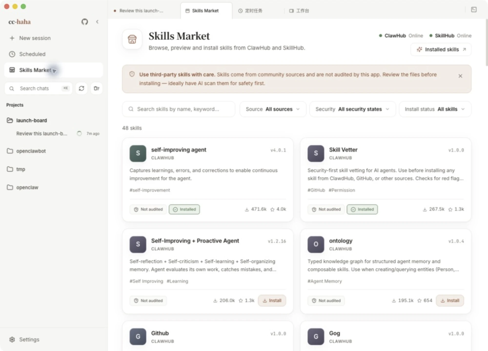

# Skills and the Skills Market

A skill is a procedure someone else already worked out. Install it and Claude follows it whenever the matching situation comes up. A "PDF handling" skill, for instance, tells it which library to use, what order to split pages in, and what to do with an encrypted file — so you don't have to explain it every time.

**How it differs from an agent**: an agent is a worker with its own context and tool scope; a skill is knowledge and procedure that an agent loads. Delegating to an agent is hiring someone; installing a skill is handing them a manual.

## The Skills Market

Click **Skills Market** in the sidebar. It aggregates two sources, **ClawHub** and **SkillHub**, and loads more as you scroll — there is no "load more" button.

Three filters across the top:

- **Source** — all sources, ClawHub, or SkillHub.
- **Security** — see below.
- **Install status** — all skills, installed, or not installed.

The search box matches names and keywords.

### Reading the security badges

Each card carries a security badge. It reports what the **source** scanned, not an audit by this app:

| Badge | Meaning |
|---|---|
| Verified | Publisher is verified and the skill passed the source's security scan |
| Scanned safe | The source's security scan found no risks |
| Not audited | The source provided no security audit data |
| Flagged | The source's scan flagged potential risk |

"Not audited" doesn't mean unsafe — it means nobody checked. "Flagged" means don't install it unless you've read the files and understand exactly what they do.

## Before you install

A skill can bring new tools, scripts, and external dependencies, and once installed Claude may run them. The disclaimer at the top of the market means what it says: these skills come from third-party community sources and this app does not audit their contents.

Recommended:

1. Open the **Files** tab on the detail page and read `SKILL.md` and any accompanying scripts.
2. If you're unsure, have Claude look first — "check this skill's files for anything suspicious".
3. Confirm you actually need it. More skills isn't more capability; every skill costs context.

**Install** opens a confirmation with the install location, the security note, and a reminder that the skill takes effect in new sessions. **Sessions already open won't pick it up** — start a new one.

Uninstall lives in the same place and deletes the local files under that skill's directory.

## Installed skills

**Settings → Skills** lists everything available on this machine, grouped by source:

- **User** — installed by you, in `~/.claude/skills/`.
- **Project** — shipped with the repo.
- **Plugin** — bundled by a plugin.
- **Built-in** — shipped with the app.

Each entry shows its entry file, file count, and estimated token cost. Open one to switch between **doc mode** and **code mode** and read the skill's prose and source files directly.

### The `.agents/skills` convention

Besides `~/.claude/skills/`, the desktop app also reads `~/.agents/skills/`. That's an open standard directory shared with Codex, Cursor, Gemini CLI, and other clients — install once, use it everywhere. Skills from that directory are tagged `.agents` in the list.

A project's own `.agents/skills/` works the same way: it ships with the repo rather than being something you installed.

:::warning
A shared directory means skills another client installed also apply here. Scan **Settings → Skills** occasionally and make sure nothing on the list is a stranger.
:::

For how skills are loaded and what the file format is, see [Skills internals](../internals/skills.md).
