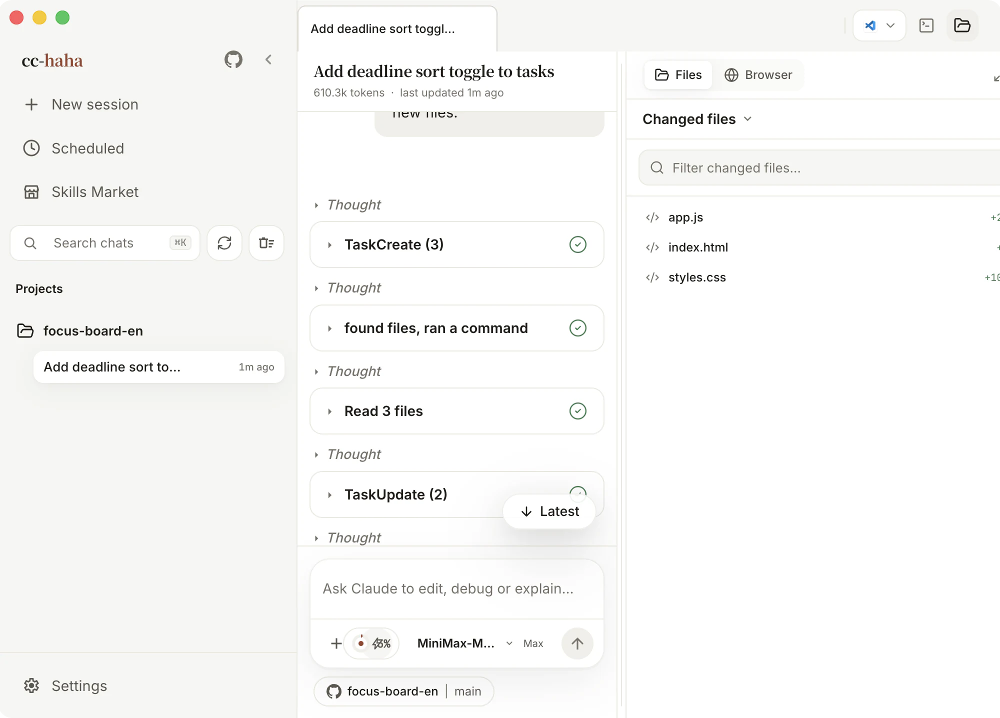

# Workspace

The conversation tells you what Claude said. The workspace tells you what it actually changed. It's a panel on the right that you can pull out next to the conversation, so you never have to switch windows.

## Opening it

Click the folder icon on the right of the tab bar. Click it again to collapse. Drag the panel's left edge to resize.

At the top of the panel is a **Files / Browser** switch:

- **Files** — project files, Git changes, and diff review.
- **Browser** — a built-in browser for previewing the page you just changed.

## Changed files and All files

In Files mode there are two views:

- **Changed files** — only files with uncommitted changes in this Git repo, each row showing its status (modified, added, deleted, renamed, untracked) and lines added or removed. This is where you'll spend review time.
- **All files** — the full directory tree. The search box above it matches file names across the whole project, including directories you haven't expanded yet.

Click a file name to open a preview: a diff in two columns, or the file itself. Previews accumulate as tabs, like an editor.

When the directory isn't a Git repo, **Changed files** says so plainly — that isn't an error.

Any file can have its path copied, or be pushed back into the composer as context with **Add to chat**.

## Diff review: leaving a note on a line

The diff keeps old and new lines with full syntax highlighting. The genuinely useful part is line-level comments:

1. Click a line — a comment box opens beside it.
2. To comment on a range, hold `Shift` and click the first and last line. The selection must stay on one side of the diff and inside one hunk.
3. Describe what you want changed there and click **Submit**.
4. The comment goes back into the composer along with the file path, line numbers, and the code itself, ready to send.

This is far more precise than describing "the null check in that one function" in prose.

If Claude changes the file while you're writing a comment, the panel tells you the diff has updated and asks you to reselect — that's there to stop a comment from landing on the wrong lines.

:::tip
Denied tool calls never reach disk, so they never show up in Changed files. Even so, give `git diff` one last read before you ship.
:::

## Isolated worktree: keeping experiments caged

The **Location** control in the composer offers **Isolated worktree**. Turn it on and the session gets its own Git worktree; everything Claude does happens there, and your current branch and working directory are untouched.

When it earns its keep:

- You want Claude to attempt a big rewrite you may not keep.
- Your working directory has uncommitted changes, so Git would block a branch switch.
- The branch you want is already checked out in another worktree.

The temporary worktree is cleaned up when you're done. History stays readable, but to continue you'll need a new session in the original project — the app tells you when that's the case.

## Built-in browser

Switch the workspace panel to **Browser** and type a local dev address or any URL. Three buttons here exist specifically so Claude can see what you see:

- **Capture** — send the current rendering back into the conversation.
- **Pick element** — click an element on the page; its selector, position, and a screenshot go to Claude as context. This saves an enormous amount of back-and-forth on styling.
- **Zoom** — change the preview scale to check responsive layouts.

Logins and cookies in this browser are real, same as any browser. Before you demo or screenshot anything publicly, switch to a page that doesn't require signing in.
