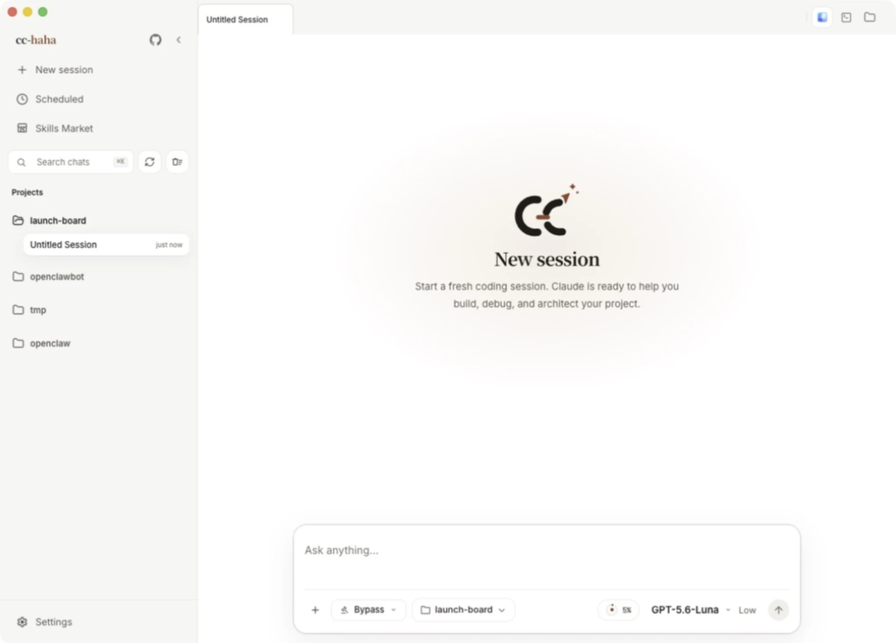
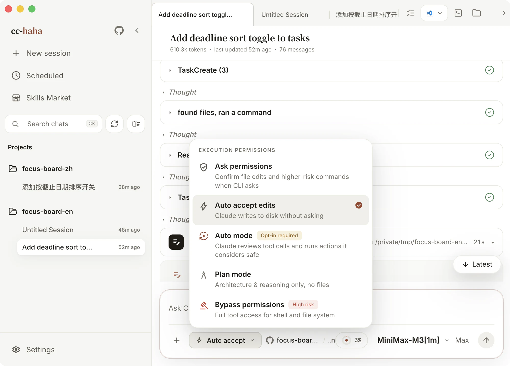

# Run your first session

Your model is connected. Now let it actually do something. Find a project you don't mind touching — ideally one under Git, so anything it breaks is one command away from being undone.

## 1. New session, pick the project folder

Click "New session" in the sidebar, or press `Cmd/Ctrl + N`.



Look at the row along the bottom of the composer: `+` for attachments, then **permission mode**, **launch location**, **model and effort**, and finally "Run".

Start with the **launch location** pill in the middle (it reads `task-board / main` in the screenshot) and pick a project folder. This sets the agent's boundary: reading files, searching, running commands, checking Git status — all of it happens inside this directory and nowhere else.

If the folder is a Git repository, the same pill also lets you choose a branch and whether to use an isolated worktree. Skip the worktree for now — working directly in the folder makes the changes easiest to follow.

## 2. Permissions: start with "Ask permissions"

Click the permission mode button and all five levels open up.



| Mode | What the app says it does |
|---|---|
| **Ask permissions** | Confirm file edits and higher-risk commands when CLI asks |
| **Auto accept edits** | Claude writes to disk without asking |
| **Auto mode** (enable once) | Claude reviews tool calls and runs actions it considers safe |
| **Plan mode** | Architecture & reasoning only, no files |
| **Bypass permissions** (high risk) | Full tool access for shell and file system |

**Leave it on "Ask permissions" for your first run.** Every file write and every risky command stops and asks, so you can see exactly what it intends to do. Loosen it later, once you know how it behaves.

What the other four are for:

- **Auto accept edits** opens up file writes only; commands still prompt. Good once you're confident about the scope of the change.
- **Auto mode** has to be enabled once by hand. After that Claude reviews each tool call itself, running what it judges safe and blocking what it judges risky. **It reduces prompts; it does not guarantee safety.** Use it in isolated environments only.
- **Plan mode** never touches a file — it only produces a plan. Use it for read-only investigation, or to make it explain its approach before it starts.
- **Bypass permissions** removes every check. Shell and filesystem are wide open, it can delete anything, and it won't ask. **Never use it in a directory holding production credentials, personal data, or anything not under version control.**

:::danger
"Bypass permissions" is not just a slightly looser "Auto mode". Auto mode at least keeps Claude's own review in the loop; bypass removes even that.
:::

Permission modes are locked while a turn is running — what the UI shows and what's actually enforced have to match. Wait for the turn to finish, or press `Cmd/Ctrl + .` to stop it.

## 3. Say what you want

Plain language is fine; you don't need to write a spec. What matters is that the goal is **verifiable** — that you'll know how to check whether it got there.

For example:

```text
Read this project, then add a "sort by due date" toggle to the task list.
Put it to the right of the heading; clicking it switches between manual
order and due date, with undated items last. Tell me which files you changed.
```

If you'd rather ease in, ask for something read-only first: "Read this project and tell me what it does and how to start it. Don't change anything."

Press `Enter` to send (`Shift + Enter` for a newline).

## 4. Watch it work


It orients itself before it starts editing, and you'll see several kinds of card go by:

- **Tool call cards** ("Searched files, ran one command, read 4 files") — collapsed by default; expand to see exactly what it read and ran.
- **Thinking blocks** — its reasoning about the next step.
- **Permission prompts** ("Allow Claude to Edit index.html?") — these stop and wait for you. The card includes a preview of the change: green for added lines, red for removed. **Read the diff before you decide.**

Three buttons:

- **Allow** — this one time only.
- **Allow for session** — stop asking about this kind of operation for the rest of the session. Once the scope is clear, this saves a long string of repeated clicks.
- **Deny** — send it back. It will try a different approach, or ask you for more information.

To stop mid-run, use the stop button at the bottom right of the composer or press `Cmd/Ctrl + .`.

## 5. Review file by file

After each edit lands, the session shows an **inline diff**: the file path, an `+8 / -3` line count, and old and new lines side by side with syntax highlighting. That's the right view for following a single change as it happens.

Once a turn finishes and the changes pile up, open the **workspace** panel on the right ("Show Workspace" at the top right of the tab bar). It collects everything changed this turn into a list you can open for a full review, comment on specific lines, and send those comments — with their code location attached — straight back into the composer for another round.

The full workspace walkthrough is in [Workspace](../desktop/workspace.md).

:::warning
Denied edits never reach the disk, but the disk and `git diff` are the only source of truth. Run `git status` and `git diff` yourself before you ship anything — don't take the UI's word for it.
:::

## Next

- See what else it can do — [desktop feature map](../desktop/index.md)
- Keep going from your phone — [Phone and IM handoff](../desktop/remote.md)
- Something got stuck — [Won't install, won't open, won't connect](./troubleshooting.md)
