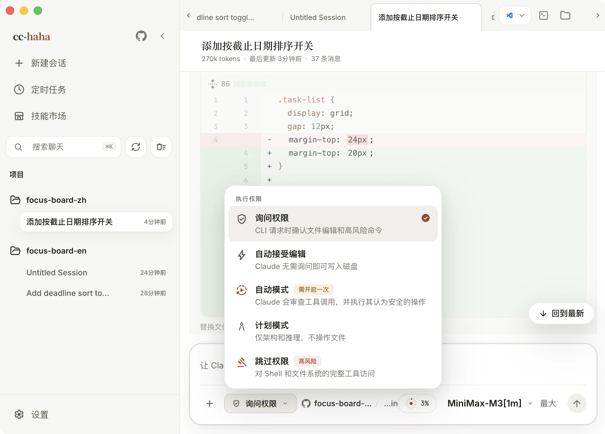

# 跑通第一条会话

模型接好了，现在让它真的动一次手。找一个你不心疼的项目——最好是有 Git 的，改坏了能一键还原。

## 1. 新建会话，选好项目目录

点侧边栏的「新建会话」，或按 `Cmd/Ctrl + N`。


看输入框底部这一排：`+` 是附件，往右依次是**权限模式**、**运行位置**、**模型 + 推理强度**，最右边是「运行」。

先点中间那颗**运行位置** pill（截图里显示的是 `task-board / main`），选一个项目文件夹。这一步定的是 Agent 的活动边界：它读文件、搜索、跑命令、看 Git 状态，全都只在这个目录里进行。

如果这个目录是 Git 仓库，pill 里还能选分支，以及要不要开「独立工作树」。第一次先别开——直接在当前目录里跑，改了什么最直观。

## 2. 权限模式：从「询问权限」开始

点权限模式按钮，五个档位摊开在你面前。



| 模式 | App 里的说明 |
|---|---|
| **询问权限** | CLI 请求时确认文件编辑和高风险命令 |
| **自动接受编辑** | Claude 无需询问即可写入磁盘 |
| **自动模式**（需开启一次） | Claude 会审查工具调用，并执行其认为安全的操作 |
| **计划模式** | 仅架构和推理，不操作文件 |
| **跳过权限**（高风险） | 对 Shell 和文件系统的完整工具访问 |

**第一次请保持「询问权限」。** 每一次写文件、每一条有风险的命令，它都会停下来问你，你能亲眼看清它想干什么。等你摸清了它的行为模式，再往上放权也不迟。

后面四档的分寸：

- **自动接受编辑** 只放开文件写入，命令仍然要问。适合"改动范围我已经想清楚了"的场景。
- **自动模式** 需要手动启用一次，之后由 Claude 自己审查每次工具调用，执行它认为安全的、拦下它认为有风险的。**它会减少询问，但不保证安全**——只在隔离环境里用。
- **计划模式** 完全不碰文件，只出方案。做只读调研、让它先讲清楚打算怎么改，用这个。
- **跳过权限** 关掉全部检查，Shell 和文件系统完全放开。它能删掉任何文件、跑任何命令，而且不会问你。**不要在有生产密钥、个人资料，或者没有版本控制的目录里开它。**

:::danger
「跳过权限」的风险跟「自动模式」不在一个量级上。自动模式至少还有一层 Claude 自己的审查，跳过权限连这层都没有。
:::

会话跑到一半时权限模式是锁住的——界面上的选择和实际生效的权限必须一致。要改就先等这一轮结束，或者按 `Cmd/Ctrl + .` 停下来。

## 3. 说出你想要什么

用大白话就行，不用装成技术需求文档。关键是**目标可验证**——说完你自己知道怎么检查它做没做到。

比如：

```text
读一下这个项目，然后给任务列表加一个「按截止日期排序」的开关：
放在标题右侧，点一下就在「手动顺序」和「按截止日期」之间切换，
没有日期的排在最后。改完告诉我动了哪几个文件。
```

拿不准就先只读地问一句：「读一下这个项目，告诉我它是干什么的、怎么启动，不要改任何文件。」

按 `Enter` 发送（`Shift + Enter` 换行）。

## 4. 看它干活


它会先摸清情况再动手，你能看到几种不同的卡片：

- **工具调用卡**（「查找到文件, 执行了一条命令, 读取了 4 个文件」）— 折叠着的，点开看它到底读了什么、跑了什么。
- **思考块** — 它对下一步的判断。
- **权限询问卡**（「允许 Claude Edit index.html？」）— 停在这里等你。卡片里直接带一份变更预览，绿色是新增行，红色是删除行。**先把这段 diff 看完再决定**。

三个按钮：

- **允许** — 只放行这一次。
- **本次会话允许** — 同类操作在这条会话里不再问。改动范围已经清楚了就用它，能省掉一连串重复点击。
- **拒绝** — 打回去。它会换个思路，或者反过来问你要更多信息。

想中途叫停，点输入框右下角的停止按钮或按 `Cmd/Ctrl + .`。

## 5. 逐个文件审阅

每次编辑落盘后，会话里会直接展示一份**内联 diff**：文件路径、`+8 / -3` 的增删统计、左右对照的行号，语法高亮照旧。看会话流里的 diff 适合跟进单次改动。

一轮跑完，改动多起来了，就打开右侧**工作区**（标签栏右上角的「显示工作区」按钮）。那里把这一轮改过的文件列成一张清单，能逐个点开做完整评审，还能对着某一行写评论、把评论连同代码位置一起带回输入框继续让它改。

工作区的完整用法见 [工作区](../desktop/workspace.md)。

:::warning
被你拒绝掉的编辑不会落到磁盘上，但最终事实源永远是磁盘和 `git diff`。交付之前自己跑一遍 `git status` 和 `git diff`，别只信界面。
:::

## 接下来

- 想看看还有哪些能力 — [桌面端功能地图](../desktop/index.md)
- 出门了想在手机上接着聊 — [手机与 IM 接力](../desktop/remote.md)
- 哪一步卡住了 — [装不上 / 打不开 / 连不上](./troubleshooting.md)
